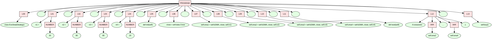

# Grammar-Guided Genetic Programming for Trading

This project demonstrates a simple grammar-guided evolutionary algorithm (genetic programming) that generates Python trading strategies, evaluates them with `backtesting.py`, and evolves toward higher performance. It also includes minimal examples and unit tests for the grammar and evolutionary pieces.




## Project Layout
- Grammar.py — Lightweight context-free grammar utilities: symbols, derivation trees, parsing via Lark, and random generation of strings from a BNF definition.
- EvolutionaryAlgorithm.py — Minimal evolutionary loop with individuals, mutation, and fitness evaluation (with length penalty).
- trading.py — Example application that uses the grammar to generate trading strategies, evaluates them on GOOG data with `backtesting.py`, and prints the best strategy found.
- trading_test.py — Unit tests covering grammar generation, fitness penalty, mutation, and error handling in the trading objective.
- requirement.txt — Python dependencies.

## Core Components
### Grammar (Grammar.py)
- Symbols: `NonterminalSymbol` and `TerminalSymbol` hold grammar token text.
- DerivationTree: Stores the root node and can return the generated string via DFS (`string()`).
- Grammar.from_bnf_text(bnf_text): Parses BNF rules like `<S> ::= <S>+<S> | x | y`, handling adjacent symbols such as `<S>+<S>`.
- Grammar.generate_derivation_tree(max_expansions=50, root_symbol=None): Randomly expands nonterminals breadth-first to produce a derivation tree and phenotype string.
- Grammar.parse_string(string): Uses Lark to parse a string back into a `DerivationTree` given the current grammar (simplified; expects the grammar to be unambiguous for the input).

### Evolutionary Algorithm (EvolutionaryAlgorithm.py)
- Individual: Wraps a genotype (derivation tree), phenotype (string), computed fitness, and complexity (phenotype length).
- EvolutionaryAlgorithm:
  - __init__(grammar, objective_function, population_size=20, complexity_coefficient=0.1)
  - _evaluate(individual): Calls the objective, adds length-based penalty, stores fitness (lower is better).
  - _get_all_nodes(node): DFS helper to collect mutation points.
  - mutate(individual): Swaps a random nonterminal subtree with a freshly generated subtree using the same grammar.
  - run(gens=10): Initializes a population from random derivations, evaluates, keeps the best, and builds the next generation with elitism and mutation of top parents.

### Trading Example (trading.py)
- BNF (trading_bnf): Defines the shape of the generated strategy class `EvoStrat(Strategy)` with SMA parameters and crossover-based buy logic.
- trading_objective(phenotype_string): Executes generated code in a sandboxed namespace containing `Strategy`, `SMA`, `crossover`, and `np`; runs a backtest on GOOG with `Backtest`; returns a penalty or negative Sortino Ratio (to minimize) as fitness.
- Main block: Builds `Grammar` from `trading_bnf`, runs `EvolutionaryAlgorithm` for a few generations, prints the best strategy, and runs a final backtest.

## Installation
1) Python: Use Python 3.9+ (tested on 3.13).
2) Create & activate a virtual environment (optional but recommended):
  ```bash
  python3 -m venv venv
  source venv/bin/activate  # Linux/macOS
  # or: venv\Scripts\activate  # Windows
  ```
3) Install dependencies:
  ```bash
  pip install -r requirement.txt
  ```

## Running
- Run trading demo: `python trading.py`
- Run tests: `pytest trading_test.py`

## How It Works (End-to-End)
1. Grammar defines search space: The BNF in trading.py restricts generated code to a safe, structured strategy template.
2. Generate population: Each individual is a random derivation tree from the grammar; its phenotype is the rendered Python code string.
3. Evaluate: trading_objective executes the code, builds a strategy class, backtests it on GOOG data, and returns a fitness (negative Sortino with penalties for failures/NaNs).
4. Select & mutate: The algorithm keeps the best individual, mutates parents from the top of the population by swapping subtrees, and forms the next generation.
5. Iterate: Over several generations, the search explores parameter combinations and conditional structures allowed by the grammar.

## Notes & Safety
- Generated code is executed with `exec` in a controlled namespace; still, only run this in a trusted, isolated environment.
- The grammar limits what can be produced, reducing risk and keeping strategies syntactically valid.
- Backtesting is done on the bundled GOOG sample from backtesting.test; results are for demonstration only, not investment advice.

## Troubleshooting
- Import errors when running tests from subfolders: Ensure project root is on `PYTHONPATH` or run tests from the repository root.
- Graphviz issues: If you extend plotting, install system Graphviz binaries (e.g., `apt-get install graphviz`).
- Backtesting warnings: Deprecation warnings from dependencies are harmless for this demo but can be silenced with `PYTHONWARNINGS="ignore::DeprecationWarning"`.

